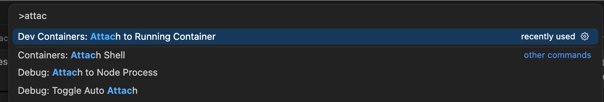
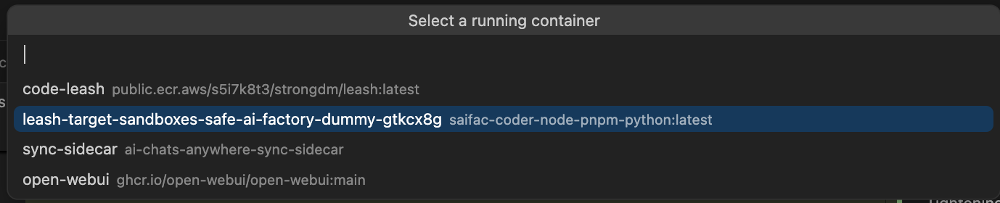
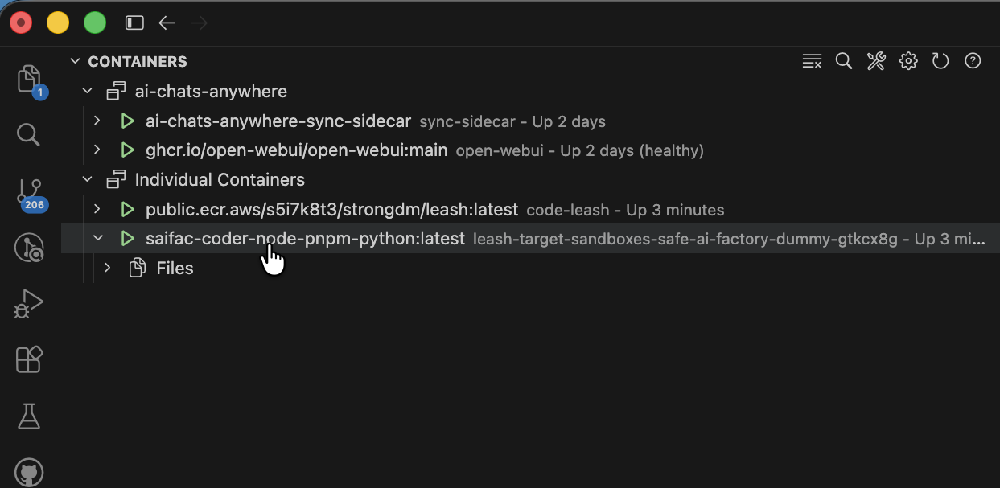
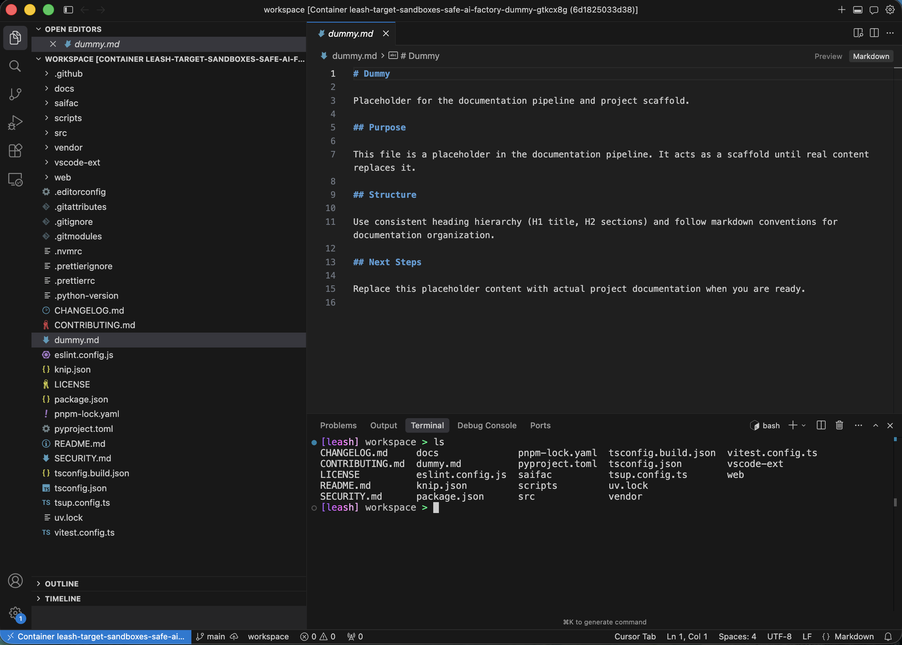
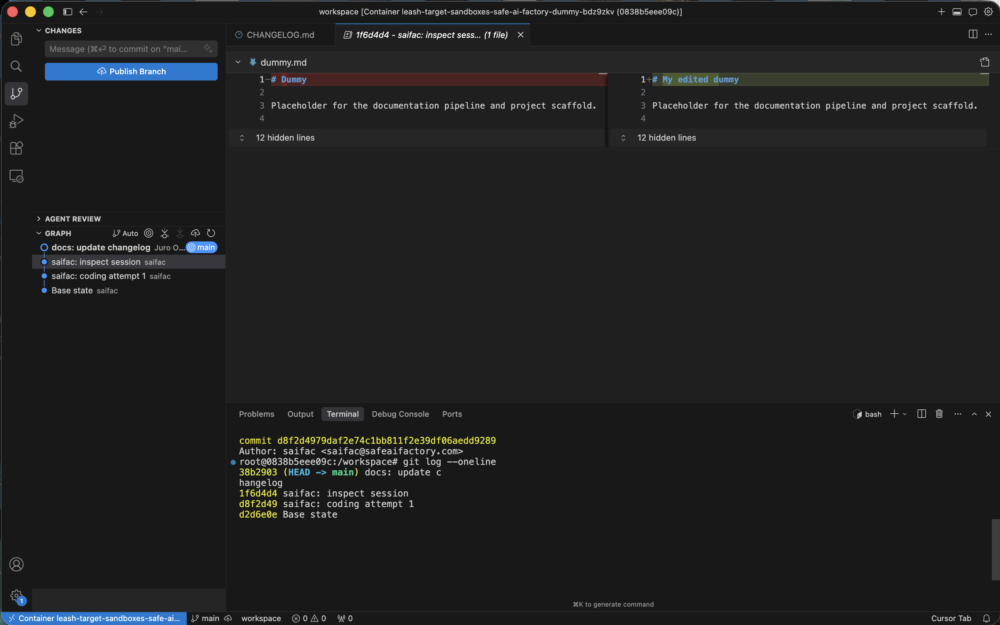
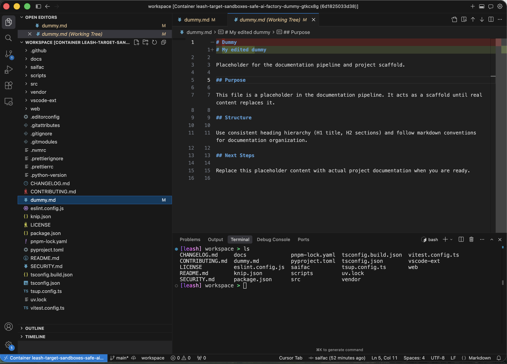

# Inspect a run's sandbox and continue from your edits

Use `saifctl run inspect` and `saifctl run start` to step into a failed run's container, fix agent mistakes by hand, and resume the agent loop from your changes.

## Prerequisites

- Docker running locally
- [VS Code Dev Containers extension](https://marketplace.visualstudio.com/items?itemName=ms-vscode-remote.remote-containers) installed
- The run ID of the failed or interrupted run (from `saifctl run list` or the run output)
- The base commit the run branched from must still be present in your local repository
- The run must be in `failed` or `interrupted` state — for a `paused` run, use `saifctl run resume` instead (see [Run lifecycle](../concepts/run-lifecycle.md))

## Steps

### 1. Open the run's container in VS Code

```bash
saifctl run inspect <runId>
```

This starts the run's saved Docker container and makes it available for Dev Containers attachment. The container preserves the workspace exactly as the agent left it, including all uncommitted changes and the full git history for that run.

Open the VS Code command palette and invoke **Dev Containers: Attach to Running Container**.



Select the run's container from the list — it appears under the run ID.



VS Code re-opens attached to the container. The status bar shows the Dev Containers indicator.



### 2. Review what the agent did

Open the Explorer to browse the in-container workspace.



Open the git history (Source Control → Timeline, or a Git Graph extension) to see the commits the agent made during the run.



### 3. Edit the code

Make whatever changes you need directly inside the container. Edits persist in the sandbox — the agent will see them when it resumes.



You can commit your changes inside the container or leave them staged/unstaged; `run start` reconstructs the workspace from the saved git commits plus any uncommitted state in the sandbox.

### 4. Continue the agent loop

From your host terminal (not the in-container VS Code), run:

```bash
saifctl run start <runId>
```

The agent re-enters the [feat-run loop](../concepts/feat-run-loop.md) at the subtask where the run failed, using your edited workspace as the starting point. It starts a new inner round for that subtask, reading your edited workspace as its starting point.

## Verification

`saifctl run list` shows the run status transition from `failed` → `running`. Watch the run output to confirm the agent picks up at the correct subtask with your edits in place.

## See also

- [Run lifecycle](../concepts/run-lifecycle.md) — status machine, `run resume` vs `run start`, pause/stop semantics
- [Feat run loop](../concepts/feat-run-loop.md) — how the convergence loop and phase/critic structure work
- [`saifctl run` reference](../../references/commands/run.md)
