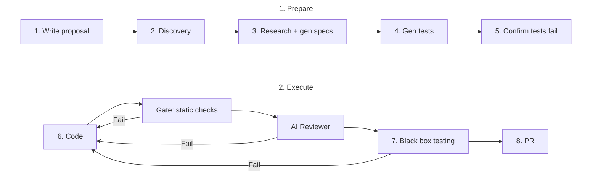

# Usage in depth

Remember: You don't write code, you write the feature spec and tests.

The agent writes code and tests its code against your tests.

## The pipeline



Full design: [docs/development/v0/](./development/v0/).

## 0. Initialize (one-time)

> _Scaffold Saifctl config; optional codebase index_

Before creating features, run the init command once:

```sh
saifctl init
```

This scaffolds `saifctl/config.ts` (if missing) and the `saifctl/` directory.

_Note: Specific Codebase indexers may require additional setup. See [Indexers](indexer/README.md)._

## 1. Create new feature

> _Create scaffold for your feature spec_

To start a new feature, create a directory for your specs and tests:

```sh
saifctl feat new

# With name and description:
saifctl feat new -n add-login --desc "Add login to the React website: email/password auth"
```

This creates a new feature directory:

`saifctl/features/add-login/`

```txt
saifctl/
└─ features/
   └─ add-login/
      └─ proposal.md
```

See [`saifctl feat new`](commands/feat-new.md) for full options.

## 2. Define feature proposal

> _Write out your feature proposal_

Fill out the feature details in `proposal.md`.

```markdown
## What Changes

Add login to the React website: email/password authentication with a protected dashboard and logout.

### Scope

- **Login page**: Form with email and password fields, "Sign in" button, and link to "Forgot password?" (forgotten password flow is out of scope).
- **Protected routes**: Wrap dashboard/home routes so unauthenticated users are redirected to `/login`.
- **Auth state**: Persist session via `localStorage` or secure cookie; on load, verify token (or cookie) before rendering protected content.
- **Logout**: Clear session and redirect to `/login`.

### Acceptance Criteria

1. User visits `/login`; submits valid email+password → success response → redirect to `/dashboard` (or home).
2. User visits `/login`; submits invalid credentials → show error message, remain on login page.
3. Unauthenticated user visits `/dashboard` → redirect to `/login`.
4. Authenticated user visits `/dashboard` → dashboard content renders.
5. User clicks "Log out" → session cleared, redirect to `/login`.

### Out of Scope

Registration, forgot password, OAuth, and email verification. Assume a backend endpoint exists at `POST /api/auth/login` returning `{ token: string }` or equivalent.
```

## 3. Research & Design

> _Run AI to convert your proposal into a detailed spec. Update what's wrong, clear out ambiguities._

By default, `feat design` runs a sandboxed coding agent that builds a proof-of-concept to explore the feature before writing the spec.

```bash
saifctl feat design -n add-login

# Pass --model to choose a specific LLM:
saifctl feat design -n add-login \
  --model anthropic/claude-sonnet-4-6
```

The designer will explore the codebase, probe constraints, and produce `specification.md` and `plan.md`.

Example output:

```txt
saifctl/
└─ features/
   └─ add-login/
      ├─ proposal.md
      ├─ specification.md  # new!
      ├─ plan.md           # new!
```

Fix factual errors, clear out ambiguities, add extra context.

**Re-running research:** If your proposal changed, re-generate `plan.md` and other files with [`design-specs`](./commands/feat-design-specs.md) command:

```bash
saifctl feat design-specs -n add-login
```

## 4. Generate tests

> _Run AI to do prepare tests. Update what's wrong, clear out ambiguities._

When you ran the `saifctl feat design` command, it also generated tests based on the enriched specs.

You will find the tests in the `tests/` directory:

```txt
saifctl/
└─ features/
   └─ add-login/
      ├─ proposal.md
      ├─ ...
      ├─ tests/            # new!
      │  ├─ tests.json
      │  ├─ tests.md
      │  ├─ helpers.ts
      │  ├─ infra.spec.ts
      │  ├─ public/
      │  │   ├─ auth-flow.spec.ts
      │  │   ├─ login-form.spec.ts
      │  │   └─ session-validation.spec.ts
      │  └─ hidden/
      │     ├─ error-handling.spec.ts
      │     ├─ negative-cases.spec.ts
      │     ├─ form-validation.spec.ts
      │     └─ session-boundaries.spec.ts
```

The `tests/` directory contains:

- `public/` - Public tests - Agent can see these. Happy paths, etc..
- `hidden/` - Hidden tests - Agent never see these. Edge cases, failures, etc.
- `tests.md` - Human-readable summary of generated tests.
- `tests.json` - Test catalog - metadata of all tests.
- `helpers.ts` - Helpers to send requests to the test runner container.
- `infra.spec.ts` - Tests to ensure staging container/sidecar work correctly.

Fix test errors, add extra tests if needed.

**Re-running test generation:** If your specs changed, re-generate `tests.json` and other test files with [`design-tests`](./commands/feat-design-tests.md) command:

```bash
saifctl feat design-tests -n add-login
```

## 5. Writing tests

> _If needed, you can write more tests._

Tests are meant to assert changes made by the agent. But importing the tested code is dangerous.

To stay safe, codebase with agent's changes is isolated in a staging container.

To assert behaviour, you send HTTP requests from the test runner to the staging container. Use provided `httpRequest()` and `execSidecar()` helpers:

- `httpRequest()` - if your project exposes a web server.
- `execSidecar()` - to safely execute a command in the staging container (over HTTP).
In both cases, you assert against the response.

**Testing web servers**

If your project is a web server, it will be started for the duration of the tests.

> NOTE: Which command runs is language-specific. See [Sandbox profiles](./sandbox-profiles.md#commands-by-profile).

You can then make HTTP requests against the staging container to probe the behaviour of the system.

```ts
// public/auth-flow.spec.ts
import { describe, expect, it } from 'vitest';
import { httpRequest } from '../helpers.js';

describe('Auth Flow', () => {
  it('tc-add-login-001: POST /login returns 200 with valid credentials', async () => {
    // Send HTTP request to your web server
    // running inside the staging container.
    const res = await httpRequest({
      method: 'POST',
      path: '/login',
      body: { user: 'alice', pass: 'secret' },
    });
    expect(res.status).toBe(200);
  });
});
```

**Testing CLI tools**

If you are not developing a website or web server, you will need
to expose your code through CLI.

Use `execSidecar()` to run CLI commands inside the staging container.

> NOTE: The staging container runs a small web server that accepts CLI commands via HTTP, runs them inside the staging container, and returns the terminal output back as an HTTP response.

```ts
// public/greet-cli.spec.ts
import { describe, expect, it } from 'vitest';
import { execSidecar } from '../helpers.js';

describe('Greet CLI', () => {
  it('tc-greet-001: greet command exits 0 and prints greeting', async () => {
    // Exec `node dist/commands/cli.js greet`
    // in staging container.
    const { stdout, stderr, exitCode } = await execSidecar('node', [
      'dist/commands/cli.js',
      'greet',
      '--name',
      'Alice',
    ]);
    expect(exitCode, `greet failed: ${stderr}`).toBe(0);
    expect(stdout).toContain('Alice');
  });
});
```

## 6. Confirm tests are failing

> _Run tests, expect them to fail_

The principle of Test-driven development (TDD) is that - before we make any changes to the codebase - the tests we wrote MUST fail against the current state (at least one).

If the tests passed right away, the agent would have nothing to optimize towards. It could write anything and it would be approved.

This check runs automatically when you run `saifctl feat design`.

**Re-running tests:** If you added or changed tests, you can re-run the initial test assertion with the [`design-fail2pass`](./commands/feat-design-fail2pass.md) command:

```bash
saifctl feat design-fail2pass -n add-login
```

After the tests successfully failed, you can start your coding agent.

**Infra vs genuine failures:** When tests fail at `fail2pass`, you can be certain it's genuine errors. Tests run in containers, which means tests can fail due to infra or network errors. However, SaifCTL handles this with health checks from the test runner to the staging container.

## 7. Run coding agent

<!--
# TODO
# TODO
# TODO

Run the coding agent to implement your specs:

```bash
saifctl feat run -n add-login
```

The agent runs in a loop: code → gate (lint, format) → semantic reviewer (if enabled) → tests. It continues until tests pass or max runs are exceeded. Use `--no-reviewer` to disable the AI reviewer.

Resume a failed run:

```bash
saifctl run start <runId>
```

See [feat run](commands/feat-run.md) for all options.
-->

<!-- TODO -->
<!-- TODO - ADD RESUME -->
<!-- TODO -->

## Guides

- [Fix agent mistakes: inspect, then run start](guides/inspect-and-start.md) — open the saved run’s coding container in VS Code or Cursor, edit by hand, then `run start`.
- [Live user feedback to the agent](guides/providing-user-feedback.md) — instructions appear in the task prompt.

## Notes

- Running tests requires Docker deamon.

- The coder agent runs inside an isolated (**Leash**) container.

- On test failures, an AI **Vague Specs Checker** decides whether the errors are due to:
  1. Genuine - the agent made an error
  2. Ambiguity in the specs

  If specs are ambiguous, the agent updates the specs. See [`feat run`](commands/feat-run.md).
